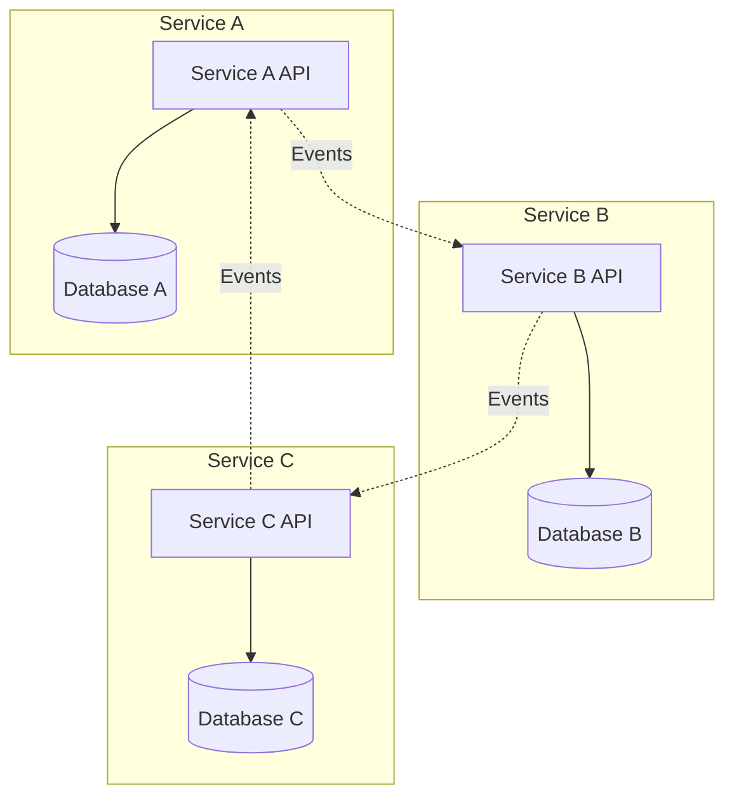
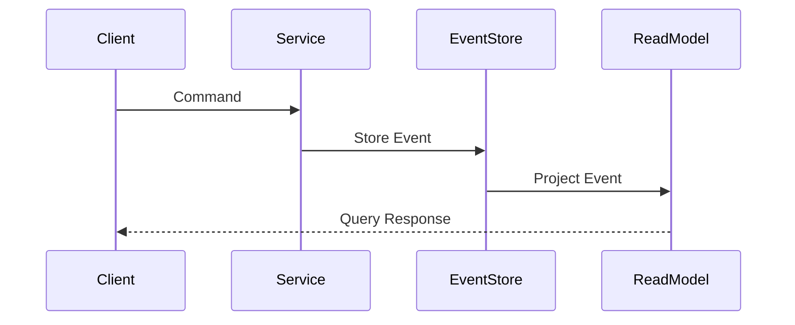
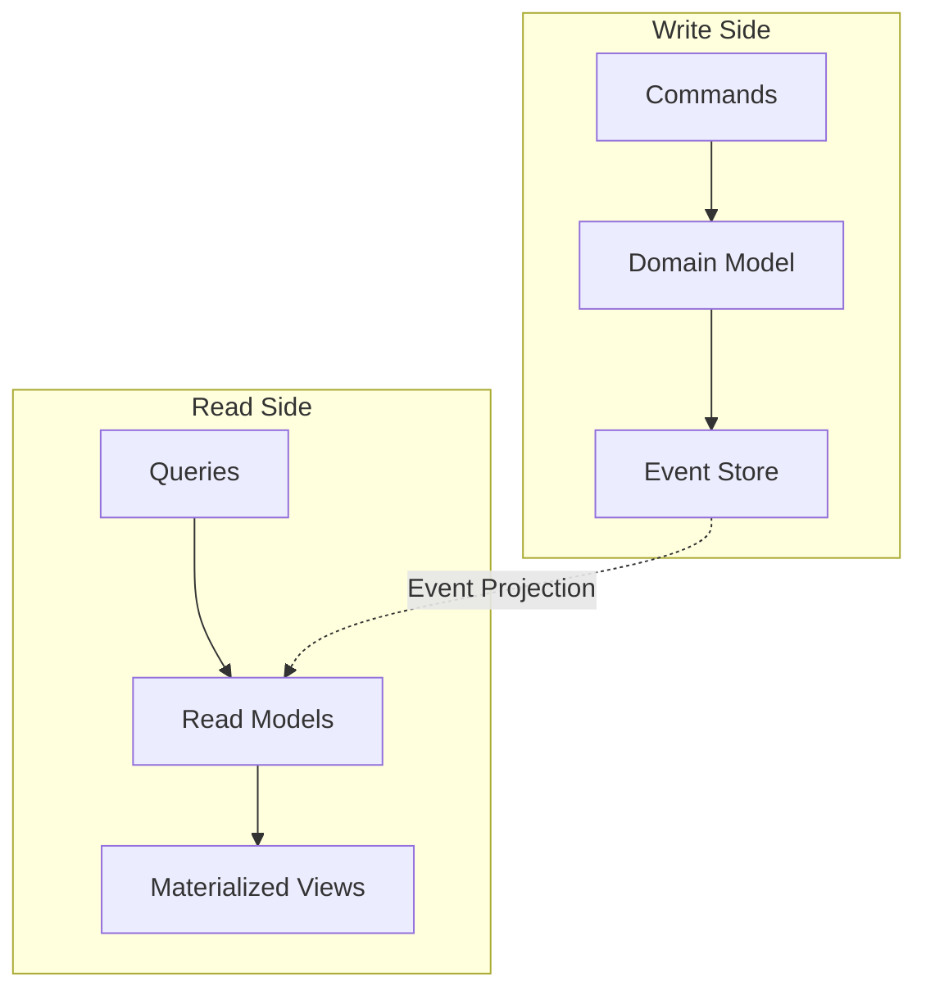
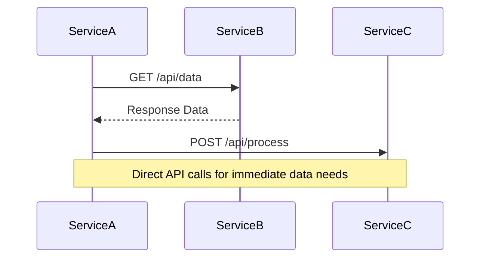
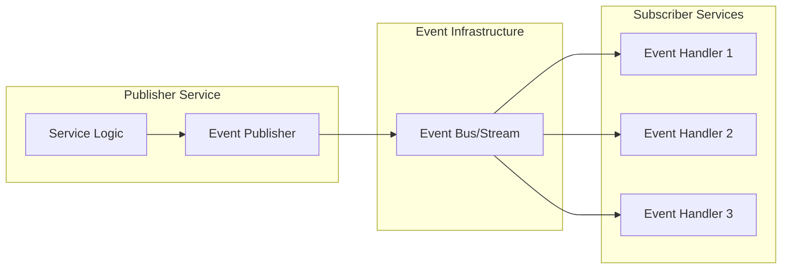
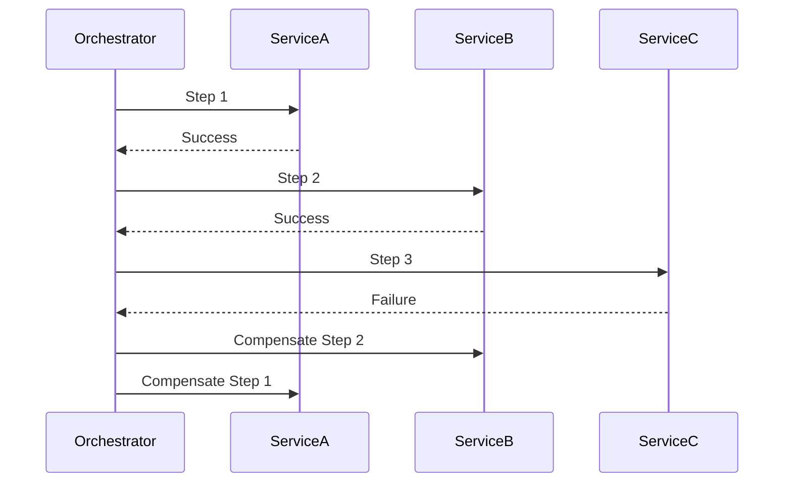
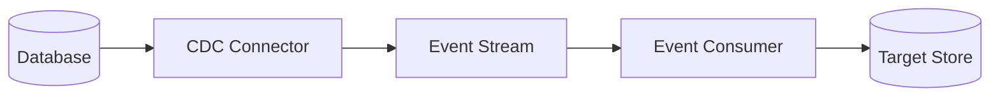
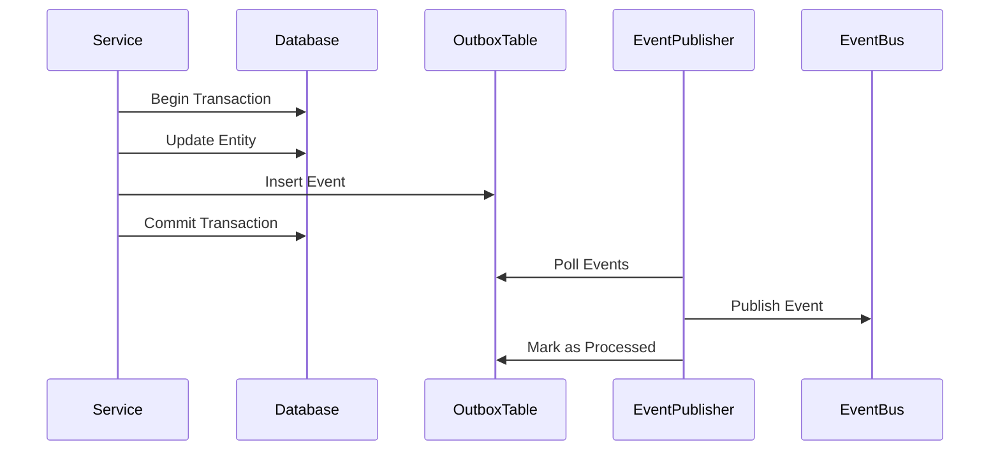
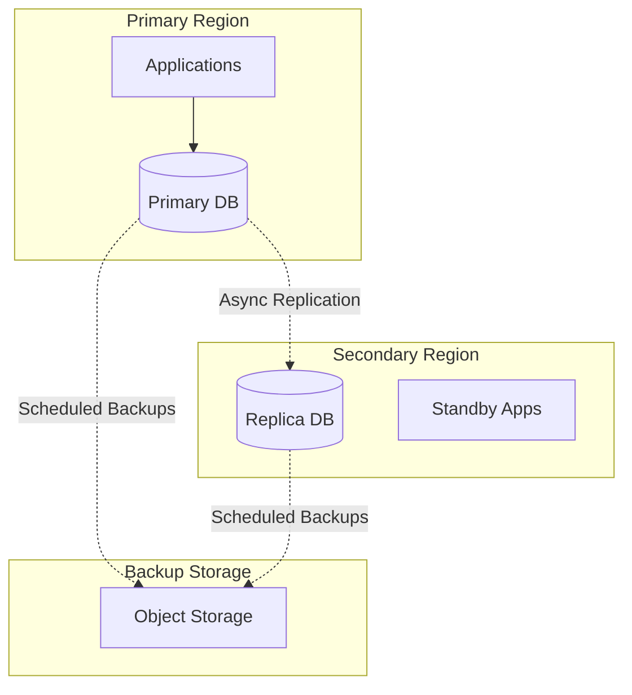
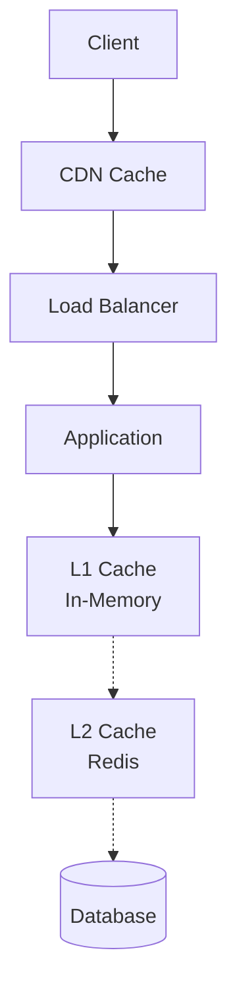

# Data Strategy

## Overview

This document defines the platform-wide data strategy, including data architecture patterns, storage solutions, data flow patterns, and governance policies for the microservices platform.

## Data Architecture Principles

### Core Principles

1. **Data Ownership**: Each service owns its data and is responsible for its consistency and integrity
2. **Service Autonomy**: Services must not directly access other services' databases
3. **Event-Driven Data Exchange**: Data sharing occurs through well-defined events and APIs
4. **Polyglot Persistence**: Use the right database technology for each service's needs
5. **Data Consistency**: Implement eventual consistency patterns across service boundaries
6. **Schema Evolution**: Support backward-compatible schema changes with versioning

### Design Patterns

#### Database-per-Service Pattern

Each microservice has its own dedicated database to ensure loose coupling and service autonomy.



**Benefits**:

- Service independence
- Technology diversity
- Fault isolation
- Scalability per service

**Challenges**:

- Cross-service queries
- Distributed transactions
- Data consistency

#### Event Sourcing Pattern

Store events that represent state changes rather than current state.



**Use Cases**:

- Audit trail requirements
- Complex business logic
- Temporal queries
- Event replay capabilities

#### CQRS (Command Query Responsibility Segregation)

Separate read and write operations using different models.



**Benefits**:

- Optimized read/write models
- Independent scaling
- Simplified queries
- Better performance

## Data Storage Technologies

### Relational Databases (PostgreSQL)

**Use Cases**:

- ACID transaction requirements
- Complex relationships
- Structured data with schema constraints
- Financial and audit data

**Configuration Standards**:

```yaml
postgresql:
  version: "15+"
  configuration:
    max_connections: 200
    shared_buffers: "256MB"
    effective_cache_size: "1GB"
    maintenance_work_mem: "64MB"
    checkpoint_completion_target: 0.9
    wal_buffers: "16MB"
    default_statistics_target: 100
  backup:
    frequency: "daily"
    retention: "30 days"
    point_in_time_recovery: true
```

**Best Practices**:

- Use connection pooling (PgBouncer)
- Implement read replicas for read-heavy workloads
- Regular VACUUM and ANALYZE operations
- Monitor query performance with pg_stat_statements

### Document Databases (MongoDB)

**Use Cases**:

- Semi-structured data
- Flexible schema requirements
- Content management
- Catalogs and product information

**Configuration Standards**:

```yaml
mongodb:
  version: "7.0+"
  replicaSet:
    members: 3
    readPreference: "secondaryPreferred"
  configuration:
    storage:
      wiredTiger:
        engineConfig:
          cacheSizeGB: 1
    operationProfiling:
      slowOpThresholdMs: 100
      mode: "slowOp"
```

**Best Practices**:

- Use appropriate indexes for query patterns
- Implement proper sharding strategy
- Monitor slow operations
- Use aggregation pipelines for complex queries

### Key-Value Stores (Redis)

**Use Cases**:

- Caching
- Session storage
- Rate limiting
- Real-time features (pub/sub)

**Configuration Standards**:

```yaml
redis:
  version: "7.0+"
  mode: "cluster"
  configuration:
    maxmemory: "1gb"
    maxmemory-policy: "allkeys-lru"
    save: "900 1 300 10 60 10000"
    appendonly: "yes"
    appendfsync: "everysec"
```

**Best Practices**:

- Set appropriate TTL for cached data
- Use Redis Cluster for high availability
- Monitor memory usage and key distribution
- Implement cache warming strategies

### Time-Series Databases (InfluxDB)

**Use Cases**:

- Metrics and monitoring data
- IoT sensor data
- Performance monitoring
- Business analytics

**Configuration Standards**:

```yaml
influxdb:
  version: "2.7+"
  retention:
    default: "30d"
    metrics: "90d"
    logs: "7d"
  downsampling:
    enabled: true
    intervals: ["1h", "1d", "1w"]
```

### Object Storage (S3-Compatible)

**Use Cases**:

- File and media storage
- Backup and archival
- Static content
- Data lake storage

**Configuration Standards**:

```yaml
objectStorage:
  buckets:
    - name: "platform-files"
      encryption: "AES256"
      versioning: true
      lifecycle:
        - rule: "archive_old_files"
          transition:
            days: 90
            storage_class: "GLACIER"
        - rule: "delete_temp_files"
          expiration:
            days: 7
            prefix: "temp/"
```

## Data Flow Patterns

### Synchronous Data Exchange

#### API-based Data Sharing



**When to Use**:

- Real-time data requirements
- Simple data queries
- Low latency needs

**Best Practices**:

- Implement circuit breakers
- Use caching for frequently accessed data
- Define clear API contracts
- Handle partial failures gracefully

### Asynchronous Data Exchange

#### Event-Driven Data Flow



**Event Schema Standards**:

```json
{
  "specversion": "1.0",
  "type": "com.platform.service.entity.action.v1",
  "source": "https://platform.com/services/service-name",
  "id": "uuid",
  "time": "2024-01-01T00:00:00Z",
  "datacontenttype": "application/json",
  "subject": "entity-id",
  "data": {
    "entityId": "uuid",
    "entityType": "EntityType",
    "action": "created|updated|deleted",
    "timestamp": "2024-01-01T00:00:00Z",
    "version": 1,
    "payload": {
      // Entity-specific data
    },
    "metadata": {
      "correlationId": "uuid",
      "causationId": "uuid",
      "userId": "uuid"
    }
  }
}
```

#### Saga Pattern for Distributed Transactions



**Saga Types**:

1. **Orchestration-based**: Central coordinator manages the saga
2. **Choreography-based**: Services coordinate through events

### Data Synchronization Patterns

#### Change Data Capture (CDC)



**Use Cases**:

- Real-time data replication
- Search index updates
- Analytics data pipelines
- Cross-service data synchronization

#### Outbox Pattern



**Benefits**:

- Guarantees event publication
- Maintains transactional consistency
- Handles publishing failures

## Data Consistency Strategies

### Consistency Levels

#### Strong Consistency

**When to Use**:

- Financial transactions
- Inventory management
- User authentication

**Implementation**:

- ACID transactions within service boundaries
- Synchronous API calls for critical operations
- Database constraints and triggers

#### Eventual Consistency

**When to Use**:

- Social media feeds
- Content recommendations
- Non-critical business data

**Implementation**:

- Event-driven updates
- Asynchronous processing
- Conflict resolution strategies

### Conflict Resolution

#### Last-Writer-Wins

Simple timestamp-based resolution for low-conflict scenarios.

```csharp
public class LastWriterWinsResolver<T> where T : ITimestamped
{
    public T Resolve(T local, T remote)
    {
        return local.LastModified > remote.LastModified ? local : remote;
    }
}
```

#### Vector Clocks

For complex distributed scenarios requiring causal ordering.

#### Application-Specific Resolution

Custom business logic for conflict resolution.

```csharp
public class InventoryConflictResolver
{
    public InventoryItem Resolve(InventoryItem local, InventoryItem remote)
    {
        // Business rule: Always take the lower quantity to be safe
        return new InventoryItem
        {
            Id = local.Id,
            Quantity = Math.Min(local.Quantity, remote.Quantity),
            LastModified = DateTime.UtcNow
        };
    }
}
```

## Data Governance

### Data Classification

#### Classification Levels

| Level | Description | Examples | Protection Requirements |
|-------|-------------|----------|------------------------|
| Public | Non-sensitive data | Marketing content, public APIs | Basic protection |
| Internal | Company internal data | Employee directories, internal docs | Access control |
| Confidential | Sensitive business data | Financial reports, strategies | Encryption at rest |
| Restricted | Highly sensitive data | PII, payment info, medical data | Full encryption, audit logging |

#### Data Labeling

```yaml
apiVersion: v1
kind: ConfigMap
metadata:
  name: data-classification
  labels:
    data.platform.com/classification: "confidential"
    data.platform.com/retention: "7-years"
    data.platform.com/region: "eu-west-1"
data:
  # Configuration data
```

### Data Retention Policies

#### Retention Rules

```json
{
  "retentionPolicies": {
    "auditLogs": {
      "retention": "7 years",
      "archival": "1 year",
      "purge": "7 years"
    },
    "userSessions": {
      "retention": "30 days",
      "archival": "none",
      "purge": "30 days"
    },
    "businessData": {
      "retention": "indefinite",
      "archival": "5 years",
      "purge": "on request"
    },
    "temporaryFiles": {
      "retention": "7 days",
      "archival": "none",
      "purge": "7 days"
    }
  }
}
```

#### Automated Retention

```sql
-- PostgreSQL example for automated cleanup
CREATE OR REPLACE FUNCTION cleanup_old_data()
RETURNS void AS $$
BEGIN
    -- Delete old audit logs
    DELETE FROM audit_logs 
    WHERE created_at < NOW() - INTERVAL '7 years';
    
    -- Delete old sessions
    DELETE FROM user_sessions 
    WHERE created_at < NOW() - INTERVAL '30 days';
    
    -- Archive old business data
    INSERT INTO business_data_archive 
    SELECT * FROM business_data 
    WHERE created_at < NOW() - INTERVAL '5 years';
    
    DELETE FROM business_data 
    WHERE created_at < NOW() - INTERVAL '5 years';
END;
$$ LANGUAGE plpgsql;

-- Schedule as cron job
SELECT cron.schedule('cleanup-old-data', '0 2 * * 0', 'SELECT cleanup_old_data();');
```

### Privacy and Compliance

#### GDPR Compliance

**Right to Access**:

```csharp
public interface IDataAccessService
{
    Task<PersonalDataExport> ExportPersonalDataAsync(string userId);
    Task<DataProcessingRecord[]> GetProcessingRecordsAsync(string userId);
}
```

**Right to Rectification**:

```csharp
public interface IDataRectificationService
{
    Task<bool> UpdatePersonalDataAsync(string userId, PersonalDataUpdate update);
    Task<bool> CorrectDataAsync(string userId, DataCorrection correction);
}
```

**Right to Erasure**:

```csharp
public interface IDataErasureService
{
    Task<bool> ErasePersonalDataAsync(string userId);
    Task<bool> AnonymizeDataAsync(string userId);
}
```

#### Data Anonymization

```csharp
public class DataAnonymizer
{
    private readonly IHashService _hashService;
    
    public AnonymizedUser AnonymizeUser(User user)
    {
        return new AnonymizedUser
        {
            Id = user.Id,
            AgeGroup = GetAgeGroup(user.DateOfBirth),
            Region = GetRegion(user.Address.Country),
            HashedEmail = _hashService.Hash(user.Email),
            // Remove all directly identifying information
        };
    }
    
    private string GetAgeGroup(DateTime dateOfBirth)
    {
        var age = DateTime.UtcNow.Year - dateOfBirth.Year;
        return age switch
        {
            < 18 => "under-18",
            < 25 => "18-24",
            < 35 => "25-34",
            < 45 => "35-44",
            < 55 => "45-54",
            < 65 => "55-64",
            _ => "65-plus"
        };
    }
}
```

## Data Quality and Monitoring

### Data Quality Metrics

#### Completeness

```sql
-- Example: Check for required field completeness
SELECT 
    COUNT(*) as total_records,
    COUNT(email) as records_with_email,
    (COUNT(email) * 100.0 / COUNT(*)) as email_completeness_percentage
FROM users;
```

#### Accuracy

```sql
-- Example: Check email format accuracy
SELECT 
    COUNT(*) as total_emails,
    COUNT(CASE WHEN email ~ '^[A-Za-z0-9._%+-]+@[A-Za-z0-9.-]+\.[A-Z|a-z]{2,}$' 
          THEN 1 END) as valid_emails,
    (COUNT(CASE WHEN email ~ '^[A-Za-z0-9._%+-]+@[A-Za-z0-9.-]+\.[A-Z|a-z]{2,}$' 
           THEN 1 END) * 100.0 / COUNT(*)) as email_accuracy_percentage
FROM users 
WHERE email IS NOT NULL;
```

#### Consistency

```sql
-- Example: Check cross-table consistency
SELECT 
    u.id,
    u.email,
    p.user_id
FROM users u
LEFT JOIN profiles p ON u.id = p.user_id
WHERE p.user_id IS NULL;  -- Users without profiles
```

### Data Monitoring

#### Real-time Data Quality Monitoring

```csharp
public class DataQualityMonitor
{
    private readonly IMetricsCollector _metrics;
    
    public async Task MonitorDataQuality<T>(IEnumerable<T> data, DataQualityRules<T> rules)
    {
        var totalRecords = data.Count();
        var validRecords = 0;
        var errors = new List<DataQualityError>();
        
        foreach (var record in data)
        {
            var validationResults = await rules.ValidateAsync(record);
            if (validationResults.IsValid)
            {
                validRecords++;
            }
            else
            {
                errors.AddRange(validationResults.Errors);
            }
        }
        
        var qualityScore = (double)validRecords / totalRecords * 100;
        
        _metrics.RecordGauge("data_quality_score", qualityScore, new[] 
        { 
            new KeyValuePair<string, string>("entity_type", typeof(T).Name) 
        });
        
        foreach (var errorGroup in errors.GroupBy(e => e.RuleType))
        {
            _metrics.RecordCounter("data_quality_errors", errorGroup.Count(), new[]
            {
                new KeyValuePair<string, string>("entity_type", typeof(T).Name),
                new KeyValuePair<string, string>("error_type", errorGroup.Key)
            });
        }
    }
}
```

## Backup and Disaster Recovery

### Backup Strategy

#### Database Backups

```yaml
backup:
  postgresql:
    full_backup:
      frequency: "daily"
      time: "02:00 UTC"
      retention: "30 days"
      compression: true
      encryption: true
    incremental_backup:
      frequency: "hourly"
      retention: "7 days"
    point_in_time_recovery:
      enabled: true
      retention: "7 days"
  
  mongodb:
    backup_type: "replica_set"
    frequency: "daily"
    time: "03:00 UTC"
    retention: "30 days"
    compression: true
    
  redis:
    rdb_backup:
      frequency: "daily"
      time: "04:00 UTC"
      retention: "7 days"
    aof_enabled: true
```

#### Cross-Region Replication



### Disaster Recovery Procedures

#### RTO/RPO Targets

| Service Tier | RTO (Recovery Time) | RPO (Data Loss) | Strategy |
|--------------|---------------------|-----------------|----------|
| Critical | < 15 minutes | < 5 minutes | Hot standby + sync replication |
| Important | < 1 hour | < 30 minutes | Warm standby + async replication |
| Standard | < 4 hours | < 2 hours | Cold standby + daily backups |

#### Failover Procedures

```bash
#!/bin/bash
# Disaster recovery failover script

# 1. Verify primary region is down
echo "Checking primary region health..."
if curl -f http://primary-region-health-check; then
    echo "Primary region is healthy. Aborting failover."
    exit 1
fi

# 2. Promote secondary database to primary
echo "Promoting secondary database..."
kubectl exec -n database postgres-replica-0 -- \
    pg_ctl promote -D /var/lib/postgresql/data

# 3. Update DNS to point to secondary region
echo "Updating DNS records..."
aws route53 change-resource-record-sets \
    --hosted-zone-id Z123456789 \
    --change-batch file://failover-dns-change.json

# 4. Scale up applications in secondary region
echo "Scaling up applications..."
kubectl scale deployment --replicas=5 -n production

# 5. Verify services are healthy
echo "Verifying service health..."
./verify-services.sh

echo "Failover completed successfully"
```

## Performance Optimization

### Database Performance

#### Index Strategy

```sql
-- Composite indexes for common query patterns
CREATE INDEX idx_users_active_created ON users (is_active, created_at) 
WHERE is_active = true;

-- Partial indexes for filtered queries
CREATE INDEX idx_orders_pending ON orders (created_at) 
WHERE status = 'pending';

-- GIN indexes for JSON queries
CREATE INDEX idx_metadata_gin ON products USING GIN (metadata);
```

#### Query Optimization

```sql
-- Use EXPLAIN ANALYZE to identify slow queries
EXPLAIN (ANALYZE, BUFFERS) 
SELECT u.*, p.name 
FROM users u 
JOIN profiles p ON u.id = p.user_id 
WHERE u.created_at > '2024-01-01'
ORDER BY u.created_at DESC 
LIMIT 100;
```

### Caching Strategy

#### Multi-Level Caching



#### Cache Patterns Implementation

```csharp
public class CacheService
{
    private readonly IMemoryCache _l1Cache;
    private readonly IDistributedCache _l2Cache;
    private readonly IDatabase _database;
    
    public async Task<T> GetAsync<T>(string key, Func<Task<T>> factory, TimeSpan? ttl = null)
    {
        // Try L1 cache first
        if (_l1Cache.TryGetValue(key, out T value))
        {
            return value;
        }
        
        // Try L2 cache
        var l2Value = await _l2Cache.GetStringAsync(key);
        if (!string.IsNullOrEmpty(l2Value))
        {
            value = JsonSerializer.Deserialize<T>(l2Value);
            _l1Cache.Set(key, value, TimeSpan.FromMinutes(5)); // Shorter TTL for L1
            return value;
        }
        
        // Fetch from source
        value = await factory();
        
        // Store in both caches
        var serialized = JsonSerializer.Serialize(value);
        await _l2Cache.SetStringAsync(key, serialized, new DistributedCacheEntryOptions
        {
            AbsoluteExpirationRelativeToNow = ttl ?? TimeSpan.FromHours(1)
        });
        
        _l1Cache.Set(key, value, TimeSpan.FromMinutes(5));
        
        return value;
    }
}
```

## Related Documentation

- [System Overview](./01-system-overview.md)
- [Global Non-Functional Requirements](./03-global-nfr.md)
- [Security Architecture](./05-security-architecture.md)
- [Deployment Strategy](./07-deployment-strategy.md)
