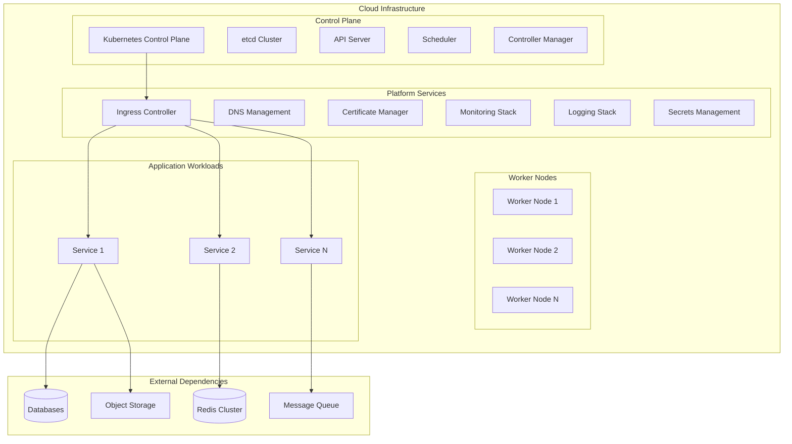
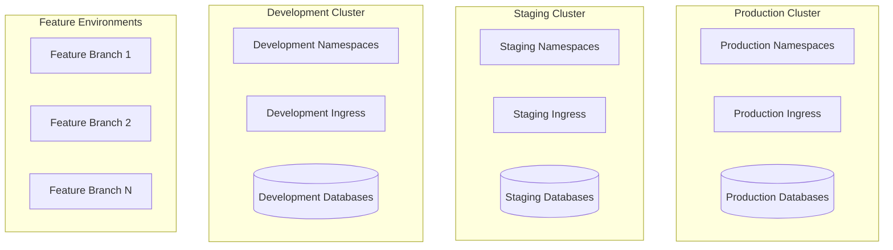
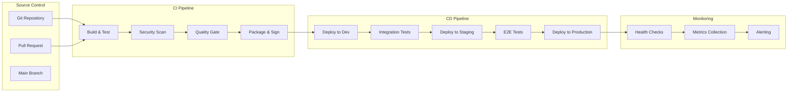
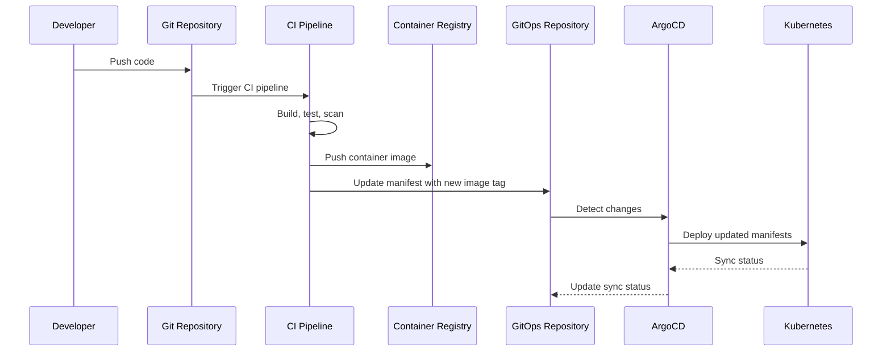
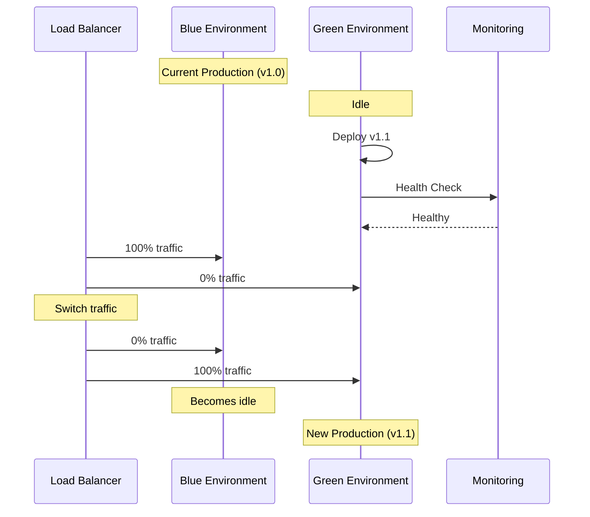
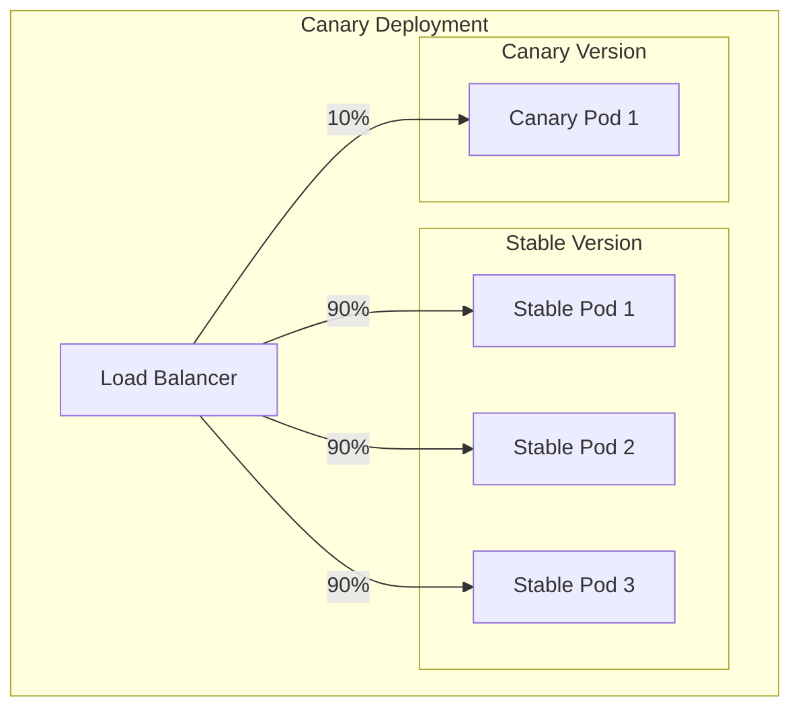
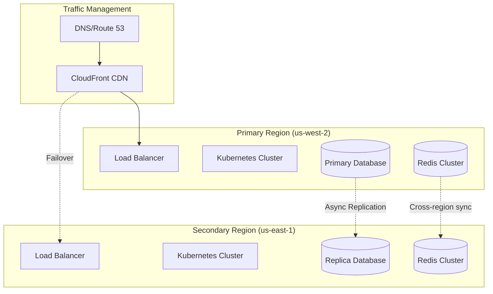

# Deployment Strategy

## Overview

This document defines the comprehensive deployment strategy for the microservices platform, including infrastructure patterns, CI/CD pipelines, environment management, and operational procedures.

## Infrastructure Architecture

### Cloud-Native Infrastructure

The platform follows cloud-native principles and can be deployed on any Kubernetes-compatible infrastructure.



### Multi-Environment Strategy

#### Environment Tiers

| Environment | Purpose | Infrastructure | Data | Access |
|-------------|---------|---------------|------|--------|
| **Development** | Local development and feature testing | Minimal resources | Synthetic data | Developer access |
| **Feature** | Feature branch testing | Ephemeral environments | Isolated test data | Automated tests |
| **Integration** | Integration testing | Shared test environment | Shared test data | CI/CD and QA |
| **Staging** | Pre-production validation | Production-like | Anonymized prod data | Limited access |
| **Production** | Live system | Full production setup | Real production data | Restricted access |

#### Environment Isolation



## Container Strategy

### Multi-Stage Dockerfile Standards

```dockerfile
# Production-ready multi-stage Dockerfile
ARG BUILDPLATFORM=linux/amd64
ARG TARGETPLATFORM=linux/amd64

FROM --platform=$BUILDPLATFORM mcr.microsoft.com/dotnet/sdk:8.0 AS build
WORKDIR /src

# Copy and restore dependencies first (better caching)
COPY ["Directory.Build.props", "."]
COPY ["Directory.Packages.props", "."]
COPY ["src/*/*.csproj", "./src/"]
RUN for file in src/*.csproj; do \
      mkdir -p "${file%/*}" && mv "$file" "${file%/*}"; \
    done
RUN dotnet restore

# Copy source and build
COPY src/ src/
WORKDIR /src/src/ServiceName
RUN dotnet build -c Release --no-restore

FROM build AS publish
RUN dotnet publish -c Release -o /app/publish \
    --no-restore \
    --no-build \
    --self-contained false \
    /p:PublishReadyToRun=true

# Runtime image
FROM --platform=$TARGETPLATFORM mcr.microsoft.com/dotnet/aspnet:8.0-alpine AS final

# Security: Create non-root user
RUN addgroup -g 1001 appgroup && \
    adduser -D -u 1001 -G appgroup appuser

WORKDIR /app

# Install security updates
RUN apk upgrade --no-cache

# Copy published application
COPY --from=publish --chown=appuser:appgroup /app/publish .

# Security: Remove unnecessary packages and files
RUN apk del --no-cache apk-tools && \
    rm -rf /var/cache/apk/* /tmp/* /var/tmp/*

# Health check
HEALTHCHECK --interval=30s \
            --timeout=10s \
            --start-period=60s \
            --retries=3 \
    CMD wget --no-verbose --tries=1 --spider http://localhost:8080/health || exit 1

# Security: Use non-root user
USER appuser

EXPOSE 8080
ENTRYPOINT ["dotnet", "ServiceName.dll"]
```

### Container Security Standards

```yaml
# Pod Security Standards
apiVersion: v1
kind: Pod
spec:
  securityContext:
    runAsNonRoot: true
    runAsUser: 1001
    runAsGroup: 1001
    fsGroup: 1001
    seccompProfile:
      type: RuntimeDefault
    supplementalGroups: []
  containers:
  - name: application
    securityContext:
      allowPrivilegeEscalation: false
      readOnlyRootFilesystem: true
      capabilities:
        drop:
        - ALL
        add: []
      privileged: false
      runAsNonRoot: true
      runAsUser: 1001
      runAsGroup: 1001
```

### Image Management

#### Registry Strategy

```yaml
containerRegistry:
  primary: "ghcr.io/organization"
  mirrors:
    - "docker.io/organization"
    - "quay.io/organization"
  
  tagging:
    stable: "v{major}.{minor}.{patch}"
    prerelease: "v{major}.{minor}.{patch}-{prerelease}"
    development: "{branch}-{commit-sha}"
    latest: "latest"
  
  security:
    scanning: true
    signVerification: true
    vulnerabilityThreshold: "medium"
    
  retention:
    stable: "2 years"
    prerelease: "6 months"
    development: "30 days"
```

#### Image Scanning Pipeline

```yaml
# Container security scanning
name: Container Security Scan

on:
  push:
    branches: [main, develop]
  pull_request:
    branches: [main]

jobs:
  security-scan:
    runs-on: ubuntu-latest
    steps:
    - uses: actions/checkout@v4
    
    - name: Build image
      run: docker build -t scan-target .
    
    - name: Run Trivy vulnerability scanner
      uses: aquasecurity/trivy-action@master
      with:
        image-ref: 'scan-target'
        format: 'sarif'
        output: 'trivy-results.sarif'
        severity: 'CRITICAL,HIGH,MEDIUM'
        exit-code: '1'
    
    - name: Run Snyk Container Scan
      uses: snyk/actions/docker@master
      env:
        SNYK_TOKEN: ${{ secrets.SNYK_TOKEN }}
      with:
        image: scan-target
        args: --severity-threshold=medium
    
    - name: Upload scan results
      uses: github/codeql-action/upload-sarif@v2
      if: always()
      with:
        sarif_file: 'trivy-results.sarif'
```

## CI/CD Pipeline Strategy

### Pipeline Architecture



### GitOps Workflow



### Pipeline Configuration

#### GitHub Actions CI/CD

```yaml
name: Microservice CI/CD

on:
  push:
    branches: [main, develop, 'feature/**']
  pull_request:
    branches: [main, develop]

env:
  REGISTRY: ghcr.io
  IMAGE_NAME: ${{ github.repository }}
  SERVICE_NAME: user-service

jobs:
  ci:
    runs-on: ubuntu-latest
    outputs:
      image-tag: ${{ steps.meta.outputs.tags }}
      image-digest: ${{ steps.build.outputs.digest }}
    
    steps:
    - name: Checkout code
      uses: actions/checkout@v4
      with:
        fetch-depth: 0  # Required for proper versioning
    
    - name: Setup .NET
      uses: actions/setup-dotnet@v3
      with:
        dotnet-version: '8.0.x'
        source-url: https://nuget.pkg.github.com/${{ github.repository_owner }}/index.json
      env:
        NUGET_AUTH_TOKEN: ${{ secrets.GITHUB_TOKEN }}
    
    - name: Cache dependencies
      uses: actions/cache@v3
      with:
        path: ~/.nuget/packages
        key: ${{ runner.os }}-nuget-${{ hashFiles('**/*.csproj') }}
        restore-keys: |
          ${{ runner.os }}-nuget-
    
    - name: Restore dependencies
      run: dotnet restore
    
    - name: Build application
      run: dotnet build --configuration Release --no-restore
    
    - name: Run unit tests
      run: |
        dotnet test --configuration Release --no-build \
          --collect:"XPlat Code Coverage" \
          --results-directory ./coverage \
          --logger "trx;LogFileName=test-results.trx"
    
    - name: Generate test report
      uses: dorny/test-reporter@v1
      if: success() || failure()
      with:
        name: .NET Tests
        path: './coverage/*.trx'
        reporter: dotnet-trx
    
    - name: Upload coverage to Codecov
      uses: codecov/codecov-action@v3
      with:
        directory: ./coverage
        flags: unittests
        name: codecov-umbrella
    
    - name: Run code analysis
      run: |
        dotnet tool install --global dotnet-sonarscanner
        dotnet sonarscanner begin \
          /k:"${{ github.repository }}" \
          /o:"${{ github.repository_owner }}" \
          /d:sonar.host.url="https://sonarcloud.io" \
          /d:sonar.token="${{ secrets.SONAR_TOKEN }}" \
          /d:sonar.cs.opencover.reportsPaths="./coverage/*/coverage.opencover.xml"
        dotnet build --configuration Release
        dotnet sonarscanner end /d:sonar.token="${{ secrets.SONAR_TOKEN }}"
    
    - name: Set up Docker Buildx
      uses: docker/setup-buildx-action@v2
    
    - name: Log in to Container Registry
      if: github.event_name != 'pull_request'
      uses: docker/login-action@v2
      with:
        registry: ${{ env.REGISTRY }}
        username: ${{ github.actor }}
        password: ${{ secrets.GITHUB_TOKEN }}
    
    - name: Extract metadata
      id: meta
      uses: docker/metadata-action@v4
      with:
        images: ${{ env.REGISTRY }}/${{ env.IMAGE_NAME }}
        tags: |
          type=ref,event=branch
          type=ref,event=pr
          type=semver,pattern={{version}}
          type=semver,pattern={{major}}.{{minor}}
          type=sha,prefix={{branch}}-
          type=raw,value=latest,enable={{is_default_branch}}
    
    - name: Build and push Docker image
      id: build
      uses: docker/build-push-action@v4
      with:
        context: .
        file: ./Dockerfile
        platforms: linux/amd64,linux/arm64
        push: ${{ github.event_name != 'pull_request' }}
        tags: ${{ steps.meta.outputs.tags }}
        labels: ${{ steps.meta.outputs.labels }}
        cache-from: type=gha
        cache-to: type=gha,mode=max
        build-args: |
          BUILDKIT_INLINE_CACHE=1
          VERSION=${{ steps.meta.outputs.version }}
    
    - name: Sign container image
      if: github.event_name != 'pull_request'
      run: |
        cosign sign --yes ${{ env.REGISTRY }}/${{ env.IMAGE_NAME }}@${{ steps.build.outputs.digest }}
      env:
        COSIGN_EXPERIMENTAL: 1

  security-scan:
    needs: ci
    runs-on: ubuntu-latest
    if: github.event_name != 'pull_request'
    
    steps:
    - name: Run Trivy vulnerability scanner
      uses: aquasecurity/trivy-action@master
      with:
        image-ref: ${{ needs.ci.outputs.image-tag }}
        format: 'sarif'
        output: 'trivy-results.sarif'
    
    - name: Upload Trivy scan results
      uses: github/codeql-action/upload-sarif@v2
      with:
        sarif_file: 'trivy-results.sarif'

  deploy-dev:
    needs: [ci, security-scan]
    runs-on: ubuntu-latest
    if: github.ref == 'refs/heads/develop'
    environment: development
    
    steps:
    - name: Checkout GitOps repository
      uses: actions/checkout@v4
      with:
        repository: organization/gitops-configs
        token: ${{ secrets.GITOPS_TOKEN }}
        path: gitops
    
    - name: Update development manifests
      run: |
        cd gitops/environments/development/${{ env.SERVICE_NAME }}
        yq e '.spec.template.spec.containers[0].image = "${{ needs.ci.outputs.image-tag }}"' -i deployment.yaml
    
    - name: Commit and push changes
      run: |
        cd gitops
        git config user.name "GitHub Actions"
        git config user.email "actions@github.com"
        git add .
        git commit -m "Update ${{ env.SERVICE_NAME }} to ${{ needs.ci.outputs.image-tag }}"
        git push

  deploy-staging:
    needs: [ci, security-scan, deploy-dev]
    runs-on: ubuntu-latest
    if: github.ref == 'refs/heads/main'
    environment: staging
    
    steps:
    - name: Checkout GitOps repository
      uses: actions/checkout@v4
      with:
        repository: organization/gitops-configs
        token: ${{ secrets.GITOPS_TOKEN }}
        path: gitops
    
    - name: Update staging manifests
      run: |
        cd gitops/environments/staging/${{ env.SERVICE_NAME }}
        yq e '.spec.template.spec.containers[0].image = "${{ needs.ci.outputs.image-tag }}"' -i deployment.yaml
    
    - name: Commit and push changes
      run: |
        cd gitops
        git config user.name "GitHub Actions"
        git config user.email "actions@github.com"
        git add .
        git commit -m "Update ${{ env.SERVICE_NAME }} staging to ${{ needs.ci.outputs.image-tag }}"
        git push

  integration-tests:
    needs: deploy-staging
    runs-on: ubuntu-latest
    
    steps:
    - name: Checkout code
      uses: actions/checkout@v4
    
    - name: Wait for deployment
      run: |
        kubectl wait --for=condition=available \
          --timeout=300s \
          deployment/${{ env.SERVICE_NAME }} \
          -n ${{ env.SERVICE_NAME }}-staging
    
    - name: Run integration tests
      run: |
        dotnet test tests/Integration.Tests/ \
          --configuration Release \
          --logger "trx;LogFileName=integration-test-results.trx" \
          --environment STAGING

  deploy-production:
    needs: [ci, security-scan, integration-tests]
    runs-on: ubuntu-latest
    if: github.ref == 'refs/heads/main'
    environment: production
    
    steps:
    - name: Manual approval checkpoint
      uses: trstringer/manual-approval@v1
      with:
        secret: ${{ secrets.GITHUB_TOKEN }}
        approvers: platform-team,lead-developers
        minimum-approvals: 2
        issue-title: "Deploy ${{ env.SERVICE_NAME }} to production"
        issue-body: |
          Please review and approve the deployment of ${{ env.SERVICE_NAME }} to production.
          
          **Image**: ${{ needs.ci.outputs.image-tag }}
          **Commit**: ${{ github.sha }}
          **Changes**: [View diff](${{ github.event.compare }})
    
    - name: Checkout GitOps repository
      uses: actions/checkout@v4
      with:
        repository: organization/gitops-configs
        token: ${{ secrets.GITOPS_TOKEN }}
        path: gitops
    
    - name: Update production manifests
      run: |
        cd gitops/environments/production/${{ env.SERVICE_NAME }}
        yq e '.spec.template.spec.containers[0].image = "${{ needs.ci.outputs.image-tag }}"' -i deployment.yaml
    
    - name: Commit and push changes
      run: |
        cd gitops
        git config user.name "GitHub Actions"
        git config user.email "actions@github.com"
        git add .
        git commit -m "Deploy ${{ env.SERVICE_NAME }} to production: ${{ needs.ci.outputs.image-tag }}"
        git push
```

## Deployment Patterns

### Blue-Green Deployment



#### Blue-Green Configuration

```yaml
# Blue-Green deployment with Argo Rollouts
apiVersion: argoproj.io/v1alpha1
kind: Rollout
metadata:
  name: service-rollout
spec:
  replicas: 5
  strategy:
    blueGreen:
      activeService: service-active
      previewService: service-preview
      autoPromotionEnabled: false
      scaleDownDelaySeconds: 30
      prePromotionAnalysis:
        templates:
        - templateName: success-rate
        args:
        - name: service-name
          value: service-name
      postPromotionAnalysis:
        templates:
        - templateName: success-rate
        args:
        - name: service-name
          value: service-name
  selector:
    matchLabels:
      app: service-name
  template:
    metadata:
      labels:
        app: service-name
    spec:
      containers:
      - name: service-name
        image: service-name:latest
        ports:
        - containerPort: 8080
```

### Canary Deployment



#### Canary Configuration

```yaml
apiVersion: argoproj.io/v1alpha1
kind: Rollout
metadata:
  name: service-rollout
spec:
  replicas: 5
  strategy:
    canary:
      steps:
      - setWeight: 10
      - pause: {duration: 10m}
      - setWeight: 25
      - pause: {duration: 10m}
      - setWeight: 50
      - pause: {duration: 10m}
      - setWeight: 75
      - pause: {duration: 10m}
      canaryService: service-canary
      stableService: service-stable
      trafficRouting:
        nginx:
          stableIngress: service-stable
          annotationPrefix: nginx.ingress.kubernetes.io
          additionalIngressAnnotations:
            canary-by-header: X-Canary
      analysis:
        templates:
        - templateName: success-rate
        startingStep: 2
        args:
        - name: service-name
          value: service-name
```

### Rolling Deployment

```yaml
apiVersion: apps/v1
kind: Deployment
metadata:
  name: service-deployment
spec:
  replicas: 6
  strategy:
    type: RollingUpdate
    rollingUpdate:
      maxUnavailable: 1      # Never have more than 1 pod down
      maxSurge: 2            # Can temporarily have 2 extra pods
  selector:
    matchLabels:
      app: service-name
  template:
    metadata:
      labels:
        app: service-name
    spec:
      containers:
      - name: service-name
        image: service-name:latest
        readinessProbe:
          httpGet:
            path: /ready
            port: 8080
          initialDelaySeconds: 10
          periodSeconds: 5
          successThreshold: 1
          failureThreshold: 3
        livenessProbe:
          httpGet:
            path: /health
            port: 8080
          initialDelaySeconds: 30
          periodSeconds: 30
          failureThreshold: 3
```

## Infrastructure as Code

### Terraform Configuration

```hcl
# terraform/environments/production/main.tf
terraform {
  required_version = ">= 1.0"
  required_providers {
    kubernetes = {
      source  = "hashicorp/kubernetes"
      version = "~> 2.16"
    }
    helm = {
      source  = "hashicorp/helm"
      version = "~> 2.8"
    }
  }
  
  backend "s3" {
    bucket = "terraform-state-production"
    key    = "platform/production.tfstate"
    region = "us-west-2"
  }
}

module "platform_infrastructure" {
  source = "../../modules/platform"
  
  environment = "production"
  cluster_name = "platform-production"
  
  # Node configuration
  node_groups = {
    general = {
      instance_types = ["m5.large", "m5.xlarge"]
      min_size       = 3
      max_size       = 10
      desired_size   = 5
    }
    compute = {
      instance_types = ["c5.large", "c5.xlarge"]
      min_size       = 2
      max_size       = 8
      desired_size   = 3
    }
  }
  
  # Network configuration
  vpc_cidr = "10.0.0.0/16"
  availability_zones = ["us-west-2a", "us-west-2b", "us-west-2c"]
  
  # Storage configuration
  storage_classes = {
    fast = {
      type = "gp3"
      iops = 3000
    }
    standard = {
      type = "gp3"
      iops = 1000
    }
  }
  
  # Security configuration
  enable_pod_security_policy = true
  enable_network_policies    = true
  enable_secrets_encryption  = true
  
  tags = {
    Environment = "production"
    Project     = "platform"
    Owner       = "platform-team"
  }
}
```

### Kustomize Structure

```yaml
# kustomization.yaml structure
apiVersion: kustomize.config.k8s.io/v1beta1
kind: Kustomization

# Base configuration
resources:
- namespace.yaml
- deployment.yaml
- service.yaml
- ingress.yaml
- configmap.yaml
- secret.yaml
- hpa.yaml
- pdb.yaml
- servicemonitor.yaml

# Configuration management
configMapGenerator:
- name: app-config
  files:
  - config/appsettings.json
  - config/logging.json

secretGenerator:
- name: app-secrets
  type: Opaque
  options:
    disableNameSuffixHash: true
  files:
  - secrets/database.env
  - secrets/api-keys.env

# Image configuration
images:
- name: service-name
  newTag: v1.2.3

# Patches for environment-specific changes
patchesStrategicMerge:
- patches/deployment-patch.yaml
- patches/service-patch.yaml

# Labels and annotations
commonLabels:
  app.kubernetes.io/name: service-name
  app.kubernetes.io/version: v1.2.3
  app.kubernetes.io/component: microservice
  app.kubernetes.io/part-of: platform

commonAnnotations:
  deployment.kubernetes.io/revision: "1"
  meta.helm.sh/release-name: service-name
```

## Monitoring and Observability

### Deployment Monitoring

```yaml
# Prometheus alerts for deployments
groups:
- name: deployment.rules
  rules:
  - alert: DeploymentReplicasMismatch
    expr: |
      kube_deployment_status_replicas_available{job="kube-state-metrics"}
        !=
      kube_deployment_spec_replicas{job="kube-state-metrics"}
    for: 5m
    labels:
      severity: warning
    annotations:
      summary: "Deployment {{ $labels.namespace }}/{{ $labels.deployment }} has mismatched replicas"
      description: "Deployment {{ $labels.namespace }}/{{ $labels.deployment }} has {{ $value }} available replicas but expects {{ query `kube_deployment_spec_replicas{deployment=\"{{ $labels.deployment }}\",namespace=\"{{ $labels.namespace }}\"}` }}"

  - alert: DeploymentRolloutStuck
    expr: |
      kube_deployment_status_condition{condition="Progressing", status="false"}
    for: 10m
    labels:
      severity: critical
    annotations:
      summary: "Deployment {{ $labels.namespace }}/{{ $labels.deployment }} rollout is stuck"
      description: "Deployment {{ $labels.namespace }}/{{ $labels.deployment }} rollout is stuck and not progressing"

  - alert: PodCrashLooping
    expr: |
      rate(kube_pod_container_status_restarts_total[5m]) * 60 * 5 > 0
    for: 2m
    labels:
      severity: warning
    annotations:
      summary: "Pod {{ $labels.namespace }}/{{ $labels.pod }} is crash looping"
      description: "Pod {{ $labels.namespace }}/{{ $labels.pod }} has restarted {{ $value }} times in the last 5 minutes"
```

### Health Check Strategy

```yaml
# Comprehensive health checks
apiVersion: v1
kind: Pod
spec:
  containers:
  - name: application
    # Startup probe - gives app time to start
    startupProbe:
      httpGet:
        path: /health/startup
        port: 8080
      initialDelaySeconds: 10
      periodSeconds: 10
      timeoutSeconds: 5
      failureThreshold: 30  # 5 minutes max startup time
      successThreshold: 1
    
    # Liveness probe - restarts container if unhealthy
    livenessProbe:
      httpGet:
        path: /health/live
        port: 8080
      initialDelaySeconds: 30
      periodSeconds: 30
      timeoutSeconds: 10
      failureThreshold: 3
      successThreshold: 1
    
    # Readiness probe - removes from service if not ready
    readinessProbe:
      httpGet:
        path: /health/ready
        port: 8080
      initialDelaySeconds: 5
      periodSeconds: 10
      timeoutSeconds: 5
      failureThreshold: 3
      successThreshold: 1
```

## Disaster Recovery and Business Continuity

### Multi-Region Deployment



### Backup and Recovery Strategy

```yaml
# Velero backup configuration
apiVersion: velero.io/v1
kind: Schedule
metadata:
  name: platform-backup
  namespace: velero
spec:
  schedule: "0 1 * * *"  # Daily at 1 AM
  template:
    includedNamespaces:
    - production
    - platform-services
    excludedResources:
    - events
    - events.events.k8s.io
    storageLocation: aws-backup
    volumeSnapshotLocations:
    - aws-snapshots
    ttl: 720h  # 30 days retention
    hooks:
      resources:
      - name: database-backup
        includedNamespaces:
        - production
        labelSelector:
          matchLabels:
            app: database
        pre:
        - exec:
            container: postgres
            command:
            - /bin/bash
            - -c
            - pg_dump $DATABASE_URL > /backup/pre-backup.sql
        post:
        - exec:
            container: postgres
            command:
            - /bin/bash
            - -c
            - rm -f /backup/pre-backup.sql
```

### Runbook for Disaster Recovery

```bash
#!/bin/bash
# Disaster Recovery Runbook

set -euo pipefail

# Configuration
PRIMARY_REGION="us-west-2"
SECONDARY_REGION="us-east-1"
NAMESPACE="production"

# Function to check region health
check_region_health() {
    local region=$1
    echo "Checking health of region: $region"
    
    # Check if API server is responsive
    if kubectl --context=$region get nodes >/dev/null 2>&1; then
        echo "✓ Kubernetes API server is responsive"
    else
        echo "✗ Kubernetes API server is not responsive"
        return 1
    fi
    
    # Check critical services
    local critical_services=("api-gateway" "user-service" "payment-service")
    for service in "${critical_services[@]}"; do
        if kubectl --context=$region get deployment $service -n $NAMESPACE >/dev/null 2>&1; then
            echo "✓ Service $service is present"
        else
            echo "✗ Service $service is missing"
            return 1
        fi
    done
    
    return 0
}

# Function to failover to secondary region
failover_to_secondary() {
    echo "Initiating failover to secondary region: $SECONDARY_REGION"
    
    # 1. Promote read replica to primary
    echo "Promoting database replica to primary..."
    kubectl --context=$SECONDARY_REGION exec -n $NAMESPACE postgresql-replica-0 -- \
        pg_promote /var/lib/postgresql/data
    
    # 2. Update DNS to point to secondary region
    echo "Updating DNS records..."
    aws route53 change-resource-record-sets \
        --hosted-zone-id Z123456789 \
        --change-batch file://failover-dns-change.json
    
    # 3. Scale up services in secondary region
    echo "Scaling up services..."
    kubectl --context=$SECONDARY_REGION scale deployment \
        --replicas=5 -n $NAMESPACE --all
    
    # 4. Wait for services to be ready
    echo "Waiting for services to be ready..."
    kubectl --context=$SECONDARY_REGION wait \
        --for=condition=available \
        --timeout=300s \
        deployment --all -n $NAMESPACE
    
    # 5. Run smoke tests
    echo "Running smoke tests..."
    ./scripts/smoke-tests.sh $SECONDARY_REGION
    
    echo "Failover completed successfully"
}

# Main disaster recovery logic
main() {
    echo "Starting disaster recovery assessment..."
    
    if check_region_health $PRIMARY_REGION; then
        echo "Primary region is healthy. No action needed."
        exit 0
    else
        echo "Primary region is unhealthy. Checking secondary region..."
        
        if check_region_health $SECONDARY_REGION; then
            echo "Secondary region is healthy. Initiating failover..."
            failover_to_secondary
        else
            echo "Both regions are unhealthy. Manual intervention required."
            exit 2
        fi
    fi
}

# Execute main function
main "$@"
```

## Security and Compliance

### Security Scanning in CI/CD

```yaml
# Security scanning workflow
name: Security Scan

on:
  push:
    branches: [main, develop]
  schedule:
    - cron: '0 2 * * *'  # Daily security scan

jobs:
  dependency-scan:
    runs-on: ubuntu-latest
    steps:
    - uses: actions/checkout@v4
    
    - name: Run dependency vulnerability scan
      uses: securecodewarrior/github-action-add-sarif@v1
      with:
        sarif-file: 'dependency-scan.sarif'
    
    - name: Run Snyk to check for vulnerabilities
      uses: snyk/actions/dotnet@master
      env:
        SNYK_TOKEN: ${{ secrets.SNYK_TOKEN }}
      with:
        args: --severity-threshold=medium
        command: test

  container-scan:
    runs-on: ubuntu-latest
    steps:
    - uses: actions/checkout@v4
    
    - name: Build image
      run: docker build -t scan-target .
    
    - name: Run Trivy vulnerability scanner
      uses: aquasecurity/trivy-action@master
      with:
        image-ref: 'scan-target'
        format: 'sarif'
        output: 'trivy-results.sarif'
    
    - name: Upload Trivy scan results
      uses: github/codeql-action/upload-sarif@v2
      with:
        sarif_file: 'trivy-results.sarif'

  secrets-scan:
    runs-on: ubuntu-latest
    steps:
    - uses: actions/checkout@v4
      with:
        fetch-depth: 0
    
    - name: Run TruffleHog OSS
      uses: trufflesecurity/trufflehog@main
      with:
        path: ./
        base: main
        head: HEAD
        extra_args: --debug --only-verified
```

### Policy as Code

```yaml
# OPA Gatekeeper policies
apiVersion: templates.gatekeeper.sh/v1beta1
kind: ConstraintTemplate
metadata:
  name: k8srequiredsecuritycontext
spec:
  crd:
    spec:
      names:
        kind: K8sRequiredSecurityContext
      validation:
        type: object
        properties:
          runAsNonRoot:
            type: boolean
          runAsUser:
            type: integer
          fsGroup:
            type: integer
  targets:
    - target: admission.k8s.gatekeeper.sh
      rego: |
        package k8srequiredsecuritycontext
        
        violation[{"msg": msg}] {
            container := input.review.object.spec.containers[_]
            not container.securityContext.runAsNonRoot
            msg := "Container must run as non-root user"
        }
        
        violation[{"msg": msg}] {
            not input.review.object.spec.securityContext.runAsUser
            msg := "Pod must specify runAsUser"
        }
---
apiVersion: constraints.gatekeeper.sh/v1beta1
kind: K8sRequiredSecurityContext
metadata:
  name: must-run-as-nonroot
spec:
  match:
    kinds:
      - apiGroups: [""]
        kinds: ["Pod"]
    excludedNamespaces: ["kube-system", "gatekeeper-system"]
  parameters:
    runAsNonRoot: true
    runAsUser: 1000
    fsGroup: 2000
```

## Related Documentation

- [System Overview](./01-system-overview.md)
- [Global Non-Functional Requirements](./03-global-nfr.md)
- [Security Architecture](./05-security-architecture.md)
- [Data Strategy](./06-data-strategy.md)
