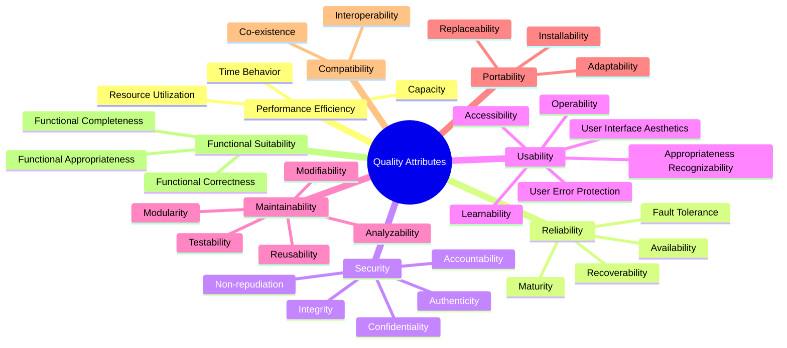

# Quality Attributes

## Overview

This document defines the cross-cutting quality attributes that apply to the entire microservices platform, establishing standards for performance, reliability, scalability, security, and maintainability across all services.

## Quality Attribute Framework

### ISO 25010 Quality Model

The platform follows the ISO 25010 software quality model, focusing on eight key quality characteristics:



## Performance Efficiency

### Response Time Standards

#### API Response Time Targets

| Endpoint Type | Target (95th percentile) | Maximum Acceptable | Measurement Method |
|---------------|--------------------------|-------------------|-------------------|
| Health Checks | < 50ms | 100ms | HTTP probe monitoring |
| Simple Queries | < 200ms | 500ms | Application metrics |
| Complex Queries | < 500ms | 1000ms | Application metrics |
| Write Operations | < 300ms | 750ms | Application metrics |
| Bulk Operations | < 2000ms | 5000ms | Application metrics |
| File Uploads | < 5000ms | 15000ms | Application metrics |

#### Background Processing

| Process Type | Target | Maximum Acceptable | SLA |
|--------------|--------|--------------------|-----|
| Event Processing | < 100ms per event | 500ms per event | 99.9% within target |
| Batch Processing | Complete within 1 hour | Complete within 4 hours | 99% within target |
| Report Generation | < 30 seconds | 2 minutes | 95% within target |
| Data Synchronization | < 5 minutes | 15 minutes | 99% within target |

### Throughput Requirements

#### Request Volume Handling

```yaml
throughputRequirements:
  apiEndpoints:
    authentication:
      peak: "5000 requests/second"
      sustained: "2000 requests/second"
      burst: "10000 requests/second for 30 seconds"
    
    businessOperations:
      peak: "2000 requests/second"
      sustained: "800 requests/second"
      burst: "5000 requests/second for 60 seconds"
    
    reporting:
      peak: "500 requests/second"
      sustained: "200 requests/second"
      burst: "1000 requests/second for 30 seconds"
  
  eventProcessing:
    peak: "10000 events/second"
    sustained: "5000 events/second"
    burst: "25000 events/second for 60 seconds"
  
  dataProcessing:
    peak: "100 MB/second"
    sustained: "50 MB/second"
    burst: "500 MB/second for 30 seconds"
```

### Resource Utilization

#### CPU and Memory Guidelines

```yaml
resourceStandards:
  microservices:
    small: # < 100 requests/second
      cpu:
        request: "100m"
        limit: "500m"
      memory:
        request: "128Mi"
        limit: "256Mi"
    
    medium: # 100-1000 requests/second
      cpu:
        request: "200m"
        limit: "1000m"
      memory:
        request: "256Mi"
        limit: "512Mi"
    
    large: # > 1000 requests/second
      cpu:
        request: "500m"
        limit: "2000m"
      memory:
        request: "512Mi"
        limit: "1Gi"
  
  databases:
    small:
      cpu: "500m to 1000m"
      memory: "1Gi to 2Gi"
      storage: "20Gi SSD"
    
    medium:
      cpu: "1000m to 2000m"
      memory: "2Gi to 4Gi"
      storage: "50Gi SSD"
    
    large:
      cpu: "2000m to 4000m"
      memory: "4Gi to 8Gi"
      storage: "100Gi+ SSD"
```

### Performance Monitoring

#### Key Performance Indicators (KPIs)

```csharp
public class PerformanceMetrics
{
    // Response time metrics
    public static readonly Counter HttpRequestsTotal = Metrics
        .CreateCounter("http_requests_total", "Total HTTP requests",
            new[] { "method", "endpoint", "status_code" });
    
    public static readonly Histogram HttpRequestDuration = Metrics
        .CreateHistogram("http_request_duration_seconds", "HTTP request duration",
            new HistogramConfiguration
            {
                Buckets = new[] { 0.01, 0.05, 0.1, 0.25, 0.5, 1.0, 2.5, 5.0, 10.0 }
            });
    
    // Resource utilization metrics
    public static readonly Gauge CpuUsage = Metrics
        .CreateGauge("cpu_usage_percent", "CPU usage percentage");
    
    public static readonly Gauge MemoryUsage = Metrics
        .CreateGauge("memory_usage_bytes", "Memory usage in bytes");
    
    // Business metrics
    public static readonly Counter BusinessOperationsTotal = Metrics
        .CreateCounter("business_operations_total", "Total business operations",
            new[] { "operation_type", "status" });
    
    public static readonly Histogram BusinessOperationDuration = Metrics
        .CreateHistogram("business_operation_duration_seconds", "Business operation duration");
}
```

## Reliability

### Availability Targets

#### Service Level Objectives (SLOs)

| Service Tier | Availability Target | Downtime Budget (Monthly) | Error Budget |
|--------------|-------------------|---------------------------|--------------|
| Critical | 99.95% | 21.6 minutes | 0.05% |
| High | 99.9% | 43.2 minutes | 0.1% |
| Medium | 99.5% | 3.6 hours | 0.5% |
| Low | 99.0% | 7.2 hours | 1.0% |

#### Availability Measurement

```csharp
public class AvailabilityCalculator
{
    public double CalculateAvailability(TimeSpan totalTime, TimeSpan downtime)
    {
        var uptime = totalTime - downtime;
        return (uptime.TotalSeconds / totalTime.TotalSeconds) * 100;
    }
    
    public TimeSpan CalculateDowntimeBudget(double availabilityTarget, TimeSpan period)
    {
        var allowedDowntimeRatio = (100 - availabilityTarget) / 100;
        return TimeSpan.FromSeconds(period.TotalSeconds * allowedDowntimeRatio);
    }
}
```

### Fault Tolerance

#### Circuit Breaker Pattern

```csharp
public class CircuitBreakerConfiguration
{
    public int FailureThreshold { get; set; } = 5;
    public TimeSpan Timeout { get; set; } = TimeSpan.FromSeconds(60);
    public int HalfOpenMaxCalls { get; set; } = 3;
    public TimeSpan HalfOpenTimeout { get; set; } = TimeSpan.FromSeconds(30);
}

// Implementation with Polly
public class ResilientHttpClient
{
    private readonly IAsyncPolicy<HttpResponseMessage> _circuitBreakerPolicy;
    
    public ResilientHttpClient(CircuitBreakerConfiguration config)
    {
        _circuitBreakerPolicy = Policy
            .HandleResult<HttpResponseMessage>(r => !r.IsSuccessStatusCode)
            .CircuitBreakerAsync(
                config.FailureThreshold,
                config.Timeout,
                onBreak: (result, duration) => 
                {
                    // Log circuit breaker opened
                },
                onReset: () => 
                {
                    // Log circuit breaker closed
                });
    }
}
```

#### Retry Policies

```yaml
retryPolicies:
  httpRequests:
    maxAttempts: 3
    backoffType: "exponential"
    baseDelay: "1s"
    maxDelay: "30s"
    jitter: true
    retryableStatusCodes: [408, 429, 500, 502, 503, 504]
  
  databaseOperations:
    maxAttempts: 5
    backoffType: "exponential"
    baseDelay: "100ms"
    maxDelay: "5s"
    jitter: true
    retryableExceptions: ["TimeoutException", "TransientException"]
  
  messagePublishing:
    maxAttempts: 10
    backoffType: "exponential"
    baseDelay: "500ms"
    maxDelay: "60s"
    jitter: true
    deadLetterAfterMaxAttempts: true
```

### Error Handling

#### Standardized Error Responses

```csharp
// RFC 7807 Problem Details implementation
public class ProblemDetails
{
    [JsonPropertyName("type")]
    public string Type { get; set; }
    
    [JsonPropertyName("title")]
    public string Title { get; set; }
    
    [JsonPropertyName("status")]
    public int? Status { get; set; }
    
    [JsonPropertyName("detail")]
    public string Detail { get; set; }
    
    [JsonPropertyName("instance")]
    public string Instance { get; set; }
    
    [JsonPropertyName("timestamp")]
    public DateTime Timestamp { get; set; } = DateTime.UtcNow;
    
    [JsonPropertyName("traceId")]
    public string TraceId { get; set; }
    
    [JsonExtensionData]
    public IDictionary<string, object> Extensions { get; set; } = 
        new Dictionary<string, object>();
}

// Global exception handler
public class GlobalExceptionHandler : IExceptionHandler
{
    public async ValueTask<bool> TryHandleAsync(
        HttpContext httpContext, 
        Exception exception, 
        CancellationToken cancellationToken)
    {
        var problemDetails = exception switch
        {
            ValidationException validationEx => CreateValidationProblem(validationEx),
            NotFoundException notFoundEx => CreateNotFoundProblem(notFoundEx),
            UnauthorizedException unauthorizedEx => CreateUnauthorizedProblem(unauthorizedEx),
            BusinessRuleException businessEx => CreateBusinessRuleProblem(businessEx),
            _ => CreateGenericProblem(exception)
        };
        
        problemDetails.Instance = httpContext.Request.Path;
        problemDetails.TraceId = Activity.Current?.Id ?? httpContext.TraceIdentifier;
        
        httpContext.Response.StatusCode = problemDetails.Status ?? 500;
        httpContext.Response.ContentType = "application/problem+json";
        
        await httpContext.Response.WriteAsync(
            JsonSerializer.Serialize(problemDetails), 
            cancellationToken);
        
        return true;
    }
}
```

## Scalability

### Horizontal Scaling

#### Auto-scaling Configuration

```yaml
# Horizontal Pod Autoscaler with custom metrics
apiVersion: autoscaling/v2
kind: HorizontalPodAutoscaler
metadata:
  name: service-hpa
spec:
  scaleTargetRef:
    apiVersion: apps/v1
    kind: Deployment
    name: service-deployment
  minReplicas: 2
  maxReplicas: 50
  metrics:
  # CPU-based scaling
  - type: Resource
    resource:
      name: cpu
      target:
        type: Utilization
        averageUtilization: 70
  
  # Memory-based scaling
  - type: Resource
    resource:
      name: memory
      target:
        type: Utilization
        averageUtilization: 80
  
  # Custom metric-based scaling
  - type: Pods
    pods:
      metric:
        name: requests_per_second
      target:
        type: AverageValue
        averageValue: "100"
  
  # External metric-based scaling
  - type: External
    external:
      metric:
        name: queue_messages_ready
        selector:
          matchLabels:
            queue: "high-priority"
      target:
        type: AverageValue
        averageValue: "10"
  
  behavior:
    scaleUp:
      stabilizationWindowSeconds: 60
      policies:
      - type: Percent
        value: 100
        periodSeconds: 60
      - type: Pods
        value: 4
        periodSeconds: 60
      selectPolicy: Max
    
    scaleDown:
      stabilizationWindowSeconds: 300
      policies:
      - type: Percent
        value: 10
        periodSeconds: 60
      selectPolicy: Min
```

### Vertical Scaling

#### Vertical Pod Autoscaler

```yaml
apiVersion: autoscaling.k8s.io/v1
kind: VerticalPodAutoscaler
metadata:
  name: service-vpa
spec:
  targetRef:
    apiVersion: apps/v1
    kind: Deployment
    name: service-deployment
  updatePolicy:
    updateMode: "Auto"
  resourcePolicy:
    containerPolicies:
    - containerName: service-container
      minAllowed:
        cpu: 100m
        memory: 128Mi
      maxAllowed:
        cpu: 2000m
        memory: 2Gi
      controlledResources: ["cpu", "memory"]
      controlledValues: RequestsAndLimits
```

### Database Scaling

#### Read Replica Strategy

```yaml
databaseScaling:
  postgresql:
    primary:
      instances: 1
      resources:
        cpu: "2000m"
        memory: "4Gi"
        storage: "100Gi"
    
    readReplicas:
      count: 3
      resources:
        cpu: "1000m"
        memory: "2Gi"
        storage: "100Gi"
      loadBalancing:
        strategy: "round-robin"
        healthCheck: true
    
    connectionPooling:
      maxConnections: 100
      minConnections: 10
      acquireIncrement: 5
      maxIdleTime: "30m"
```

## Security Quality Attributes

### Authentication and Authorization

#### JWT Token Standards

```csharp
public class JwtConfiguration
{
    public string SecretKey { get; set; }
    public string Issuer { get; set; }
    public string Audience { get; set; }
    public TimeSpan AccessTokenExpiry { get; set; } = TimeSpan.FromMinutes(15);
    public TimeSpan RefreshTokenExpiry { get; set; } = TimeSpan.FromDays(7);
    public string Algorithm { get; set; } = SecurityAlgorithms.HmacSha256;
}

public class SecureTokenService
{
    public string GenerateAccessToken(ClaimsPrincipal principal, JwtConfiguration config)
    {
        var tokenHandler = new JwtSecurityTokenHandler();
        var key = Encoding.ASCII.GetBytes(config.SecretKey);
        
        var tokenDescriptor = new SecurityTokenDescriptor
        {
            Subject = new ClaimsIdentity(principal.Claims),
            Expires = DateTime.UtcNow.Add(config.AccessTokenExpiry),
            Issuer = config.Issuer,
            Audience = config.Audience,
            SigningCredentials = new SigningCredentials(
                new SymmetricSecurityKey(key), 
                config.Algorithm),
            
            // Security enhancements
            NotBefore = DateTime.UtcNow,
            IssuedAt = DateTime.UtcNow,
            Claims = new Dictionary<string, object>
            {
                ["jti"] = Guid.NewGuid().ToString(), // JWT ID for revocation
                ["iat"] = DateTimeOffset.UtcNow.ToUnixTimeSeconds(),
                ["nbf"] = DateTimeOffset.UtcNow.ToUnixTimeSeconds()
            }
        };
        
        var token = tokenHandler.CreateToken(tokenDescriptor);
        return tokenHandler.WriteToken(token);
    }
}
```

#### Role-Based Access Control (RBAC)

```yaml
rbacModel:
  roles:
    admin:
      permissions:
        - "users:*"
        - "system:*"
        - "reports:*"
    
    manager:
      permissions:
        - "users:read"
        - "users:update"
        - "reports:read"
        - "reports:create"
    
    user:
      permissions:
        - "profile:read"
        - "profile:update"
        - "content:read"
    
    guest:
      permissions:
        - "content:read:public"
  
  policies:
    - effect: "allow"
      principals: ["role:admin"]
      actions: ["*"]
      resources: ["*"]
    
    - effect: "allow"
      principals: ["role:user"]
      actions: ["read", "update"]
      resources: ["profile:self"]
      conditions:
        - "resource.owner == principal.id"
```

### Data Protection

#### Encryption Standards

```yaml
encryptionStandards:
  atRest:
    algorithm: "AES-256-GCM"
    keyRotation: "quarterly"
    keyManagement: "HashiCorp Vault"
    
    databases:
      postgresql:
        encryptionMethod: "TDE"
        keyProvider: "external"
      
      mongodb:
        encryptionMethod: "field-level"
        keyProvider: "KMIP"
  
  inTransit:
    protocol: "TLS 1.3"
    cipherSuites:
      - "TLS_AES_256_GCM_SHA384"
      - "TLS_CHACHA20_POLY1305_SHA256"
      - "TLS_AES_128_GCM_SHA256"
    
    certificateManagement:
      provider: "cert-manager"
      issuer: "letsencrypt-prod"
      autoRenewal: true
  
  inUse:
    sensitiveFields:
      - "creditCardNumber"
      - "socialSecurityNumber"
      - "bankAccountNumber"
    
    tokenization:
      provider: "internal"
      algorithm: "format-preserving"
      keyRotation: "monthly"
```

### Security Monitoring

#### Security Events and Alerting

```csharp
public class SecurityEventLogger
{
    private readonly ILogger<SecurityEventLogger> _logger;
    private readonly IMetricsCollector _metrics;
    
    public void LogAuthenticationFailure(string userId, string ipAddress, string reason)
    {
        _logger.LogWarning("Authentication failure for user {UserId} from {IpAddress}: {Reason}",
            userId, ipAddress, reason);
            
        _metrics.RecordCounter("authentication_failures_total", 1, new[]
        {
            new KeyValuePair<string, string>("reason", reason),
            new KeyValuePair<string, string>("source_ip", ipAddress)
        });
    }
    
    public void LogSuspiciousActivity(string activity, string userId, string details)
    {
        _logger.LogWarning("Suspicious activity detected: {Activity} by user {UserId}. Details: {Details}",
            activity, userId, details);
            
        _metrics.RecordCounter("suspicious_activities_total", 1, new[]
        {
            new KeyValuePair<string, string>("activity_type", activity),
            new KeyValuePair<string, string>("user_id", userId)
        });
    }
    
    public void LogDataAccess(string resource, string userId, string action)
    {
        _logger.LogInformation("Data access: {Action} on {Resource} by user {UserId}",
            action, resource, userId);
            
        _metrics.RecordCounter("data_access_total", 1, new[]
        {
            new KeyValuePair<string, string>("resource", resource),
            new KeyValuePair<string, string>("action", action)
        });
    }
}
```

## Maintainability

### Code Quality Standards

#### Code Metrics Thresholds

```yaml
codeQualityStandards:
  coverage:
    minimum: 80
    target: 90
    critical_paths: 95
  
  complexity:
    cyclomatic_complexity:
      method_max: 10
      class_max: 50
    
    cognitive_complexity:
      method_max: 15
      class_max: 100
  
  maintainability:
    maintainability_index: "> 70"
    lines_of_code:
      method_max: 50
      class_max: 500
      file_max: 1000
  
  duplication:
    maximum_percentage: 5
    minimum_lines: 10
  
  documentation:
    public_api_coverage: 100
    internal_api_coverage: 80
```

#### Static Code Analysis

```yaml
# SonarQube quality gate
sonarQube:
  qualityGate:
    conditions:
      - metric: "new_coverage"
        op: "LT"
        error: "80"
      
      - metric: "new_duplicated_lines_density"
        op: "GT"
        error: "3"
      
      - metric: "new_maintainability_rating"
        op: "GT"
        error: "1"
      
      - metric: "new_reliability_rating"
        op: "GT"
        error: "1"
      
      - metric: "new_security_rating"
        op: "GT"
        error: "1"
      
      - metric: "new_security_hotspots_reviewed"
        op: "LT"
        error: "100"
```

### API Design Standards

#### RESTful API Quality

```csharp
// API versioning and documentation standards
[ApiController]
[ApiVersion("1.0")]
[Route("api/v{version:apiVersion}/[controller]")]
[Produces("application/json")]
[ProducesResponseType(typeof(ProblemDetails), StatusCodes.Status400BadRequest)]
[ProducesResponseType(typeof(ProblemDetails), StatusCodes.Status500InternalServerError)]
public class UsersController : ControllerBase
{
    /// <summary>
    /// Retrieves a user by their unique identifier
    /// </summary>
    /// <param name="id">The unique identifier of the user</param>
    /// <param name="cancellationToken">Cancellation token</param>
    /// <returns>The user details</returns>
    /// <response code="200">User found and returned successfully</response>
    /// <response code="404">User not found</response>
    /// <response code="400">Invalid user ID format</response>
    [HttpGet("{id:guid}")]
    [ProducesResponseType(typeof(UserResponse), StatusCodes.Status200OK)]
    [ProducesResponseType(typeof(ProblemDetails), StatusCodes.Status404NotFound)]
    public async Task<ActionResult<UserResponse>> GetUserAsync(
        Guid id, 
        CancellationToken cancellationToken = default)
    {
        // Implementation
    }
}
```

### Testing Standards

#### Test Pyramid Implementation

```csharp
// Unit test standards
[TestClass]
public class UserServiceTests
{
    private readonly Mock<IUserRepository> _mockRepository;
    private readonly Mock<IValidator<CreateUserRequest>> _mockValidator;
    private readonly UserService _service;
    
    public UserServiceTests()
    {
        _mockRepository = new Mock<IUserRepository>();
        _mockValidator = new Mock<IValidator<CreateUserRequest>>();
        _service = new UserService(_mockRepository.Object, _mockValidator.Object);
    }
    
    [TestMethod]
    [TestCategory("Unit")]
    public async Task CreateUserAsync_WithValidRequest_ShouldReturnSuccess()
    {
        // Arrange
        var request = UserTestDataBuilder.ValidCreateUserRequest();
        var expectedUser = UserTestDataBuilder.UserFromRequest(request);
        
        _mockValidator.Setup(v => v.ValidateAsync(request))
                     .ReturnsAsync(new ValidationResult());
        
        _mockRepository.Setup(r => r.CreateAsync(It.IsAny<User>()))
                      .ReturnsAsync(expectedUser);
        
        // Act
        var result = await _service.CreateUserAsync(request);
        
        // Assert
        Assert.IsTrue(result.IsSuccess);
        Assert.AreEqual(expectedUser.Id, result.Value.Id);
        
        _mockRepository.Verify(r => r.CreateAsync(It.IsAny<User>()), Times.Once);
        _mockValidator.Verify(v => v.ValidateAsync(request), Times.Once);
    }
}

// Integration test standards
[TestClass]
public class UserControllerIntegrationTests : IntegrationTestBase
{
    [TestMethod]
    [TestCategory("Integration")]
    public async Task GetUser_WithValidId_ShouldReturn200()
    {
        // Arrange
        var user = await SeedUserAsync();
        
        // Act
        var response = await HttpClient.GetAsync($"/api/v1/users/{user.Id}");
        
        // Assert
        Assert.AreEqual(HttpStatusCode.OK, response.StatusCode);
        
        var userResponse = await response.Content.ReadFromJsonAsync<UserResponse>();
        Assert.IsNotNull(userResponse);
        Assert.AreEqual(user.Id, userResponse.Id);
    }
}
```

## Observability Quality Attributes

### Monitoring Standards

#### Metrics Collection

```csharp
public class MetricsCollectionService
{
    // RED metrics (Rate, Errors, Duration)
    private static readonly Counter RequestsTotal = Metrics
        .CreateCounter("http_requests_total", 
            "Total number of HTTP requests",
            new[] { "method", "endpoint", "status" });
    
    private static readonly Histogram RequestDuration = Metrics
        .CreateHistogram("http_request_duration_seconds",
            "Duration of HTTP requests in seconds",
            new[] { "method", "endpoint" });
    
    // USE metrics (Utilization, Saturation, Errors)
    private static readonly Gauge CpuUtilization = Metrics
        .CreateGauge("cpu_utilization_percent",
            "CPU utilization percentage");
    
    private static readonly Gauge MemoryUtilization = Metrics
        .CreateGauge("memory_utilization_percent",
            "Memory utilization percentage");
    
    // Business metrics
    private static readonly Counter BusinessEventsTotal = Metrics
        .CreateCounter("business_events_total",
            "Total number of business events",
            new[] { "event_type", "status" });
    
    private static readonly Gauge ActiveUsers = Metrics
        .CreateGauge("active_users_total",
            "Number of currently active users");
}
```

#### Distributed Tracing

```csharp
public class TracingConfiguration
{
    public static void ConfigureTracing(IServiceCollection services, IConfiguration configuration)
    {
        services.AddOpenTelemetry()
            .WithTracing(builder => builder
                .SetSampler(new TraceIdRatioBasedSampler(0.1)) // 10% sampling in production
                .AddSource("Platform.*")
                .AddAspNetCoreInstrumentation(options =>
                {
                    options.RecordException = true;
                    options.EnableGrpcAspNetCoreSupport = true;
                    options.Filter = httpContext =>
                    {
                        // Don't trace health checks
                        return !httpContext.Request.Path.StartsWithSegments("/health");
                    };
                    options.EnrichWithHttpRequest = (activity, httpRequest) =>
                    {
                        activity.SetTag("user.id", httpRequest.Headers["X-User-Id"].FirstOrDefault());
                        activity.SetTag("correlation.id", httpRequest.Headers["X-Correlation-Id"].FirstOrDefault());
                    };
                })
                .AddEntityFrameworkCoreInstrumentation()
                .AddRedisInstrumentation()
                .AddOtlpExporter(options =>
                {
                    options.Endpoint = new Uri(configuration["OpenTelemetry:Endpoint"]);
                }));
    }
}
```

### Logging Standards

#### Structured Logging

```csharp
public static class LoggerExtensions
{
    private static readonly Action<ILogger, string, string, Exception> _userLoggedIn =
        LoggerMessage.Define<string, string>(
            LogLevel.Information,
            new EventId(1001, "UserLoggedIn"),
            "User {UserId} logged in from {IpAddress}");
    
    private static readonly Action<ILogger, string, int, Exception> _businessOperationCompleted =
        LoggerMessage.Define<string, int>(
            LogLevel.Information,
            new EventId(2001, "BusinessOperationCompleted"),
            "Business operation {OperationType} completed in {DurationMs}ms");
    
    private static readonly Action<ILogger, string, string, Exception> _businessRuleViolated =
        LoggerMessage.Define<string, string>(
            LogLevel.Warning,
            new EventId(3001, "BusinessRuleViolated"),
            "Business rule violation: {RuleName} - {Details}");
    
    public static void UserLoggedIn(this ILogger logger, string userId, string ipAddress)
        => _userLoggedIn(logger, userId, ipAddress, null);
    
    public static void BusinessOperationCompleted(this ILogger logger, string operationType, int durationMs)
        => _businessOperationCompleted(logger, operationType, durationMs, null);
    
    public static void BusinessRuleViolated(this ILogger logger, string ruleName, string details)
        => _businessRuleViolated(logger, ruleName, details, null);
}
```

## Quality Assurance Process

### Quality Gates

#### Pipeline Quality Gates

```yaml
qualityGates:
  codeQuality:
    sonarQube:
      required: true
      conditions:
        - coverage >= 80%
        - duplicated_lines_density < 3%
        - maintainability_rating = A
        - reliability_rating = A
        - security_rating = A
  
  security:
    vulnerabilityScanning:
      required: true
      maxSeverity: "medium"
      tools: ["Snyk", "Trivy", "OWASP Dependency Check"]
    
    secretScanning:
      required: true
      tools: ["GitLeaks", "TruffleHog"]
  
  performance:
    loadTesting:
      required: true
      thresholds:
        - response_time_95th < 500ms
        - error_rate < 1%
        - throughput >= baseline * 0.95
  
  compliance:
    codeStandards:
      required: true
      tools: ["EditorConfig", "StyleCop", "ESLint"]
    
    documentation:
      required: true
      coverage: 80%
```

### Continuous Quality Monitoring

#### Quality Metrics Dashboard

```json
{
  "qualityDashboard": {
    "codeQuality": {
      "coverage": {
        "current": 85.2,
        "target": 80,
        "trend": "increasing"
      },
      "technicalDebt": {
        "current": "2.5 days",
        "target": "< 5 days",
        "trend": "stable"
      },
      "codeSmells": {
        "current": 12,
        "target": "< 20",
        "trend": "decreasing"
      }
    },
    "performance": {
      "responseTime": {
        "current": "245ms",
        "target": "< 500ms",
        "trend": "stable"
      },
      "throughput": {
        "current": "1250 req/s",
        "target": "> 1000 req/s",
        "trend": "increasing"
      },
      "errorRate": {
        "current": "0.2%",
        "target": "< 1%",
        "trend": "stable"
      }
    },
    "security": {
      "vulnerabilities": {
        "high": 0,
        "medium": 2,
        "low": 5,
        "trend": "improving"
      },
      "securityScore": {
        "current": 95,
        "target": "> 90",
        "trend": "stable"
      }
    }
  }
}
```

## Related Documentation

- [System Overview](./01-system-overview.md)
- [Global Non-Functional Requirements](./03-global-nfr.md)
- [Security Architecture](./05-security-architecture.md)
- [Testing Strategy](./cross-cutting/testing-strategy.md)
