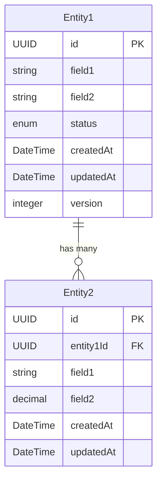

# Data Model

## Overview

This document defines the data model for [Service Name], including domain entities, persistence schema, and data relationships.

## Domain Model

### Core Entities

#### Entity: [Entity Name]

**Description**: [Brief description of what this entity represents]

**Properties**:

| Property | Type | Required | Description | Constraints |
|----------|------|----------|-------------|-------------|
| id | UUID | Yes | Unique identifier | Primary Key |
| field1 | string | Yes | [Description] | Max 255 chars |
| field2 | string | No | [Description] | Max 1000 chars |
| status | enum | Yes | Current status | [enum values] |
| createdAt | DateTime | Yes | Creation timestamp | UTC format |
| updatedAt | DateTime | Yes | Last update timestamp | UTC format |
| version | integer | Yes | Optimistic locking version | Auto-increment |

**Invariants**:

- [Business rule that must always be true]
- [Another business rule]

**Example**:

```json
{
  "id": "550e8400-e29b-41d4-a716-446655440000",
  "field1": "example value",
  "field2": "another value",
  "status": "active",
  "createdAt": "2024-01-01T00:00:00Z",
  "updatedAt": "2024-01-01T00:00:00Z",
  "version": 1
}
```

#### Entity: [Related Entity Name]

**Description**: [Brief description of what this entity represents]

**Properties**:

| Property | Type | Required | Description | Constraints |
|----------|------|----------|-------------|-------------|
| id | UUID | Yes | Unique identifier | Primary Key |
| parentId | UUID | Yes | Reference to parent entity | Foreign Key |
| field1 | string | Yes | [Description] | Max 255 chars |
| field2 | decimal | No | [Description] | Precision(10,2) |
| createdAt | DateTime | Yes | Creation timestamp | UTC format |
| updatedAt | DateTime | Yes | Last update timestamp | UTC format |

### Value Objects

#### Value Object: [Value Object Name]

**Description**: [Description of what this value object encapsulates]

**Properties**:

| Property | Type | Required | Description | Constraints |
|----------|------|----------|-------------|-------------|
| property1 | string | Yes | [Description] | [Constraints] |
| property2 | integer | Yes | [Description] | [Constraints] |

**Invariants**:

- [Rule that ensures validity of the value object]
- [Another validation rule]

**Example**:

```json
{
  "property1": "value",
  "property2": 42
}
```

### Enumerations

#### Enum: [Enum Name]

**Description**: [Description of what this enumeration represents]

**Values**:

| Value | Description | Business Meaning |
|-------|-------------|------------------|
| VALUE1 | [Description] | [Business context] |
| VALUE2 | [Description] | [Business context] |
| VALUE3 | [Description] | [Business context] |

## Data Relationships

### Entity Relationship Diagram



### Relationship Descriptions

#### Entity1 → Entity2

- **Relationship Type**: One-to-Many
- **Description**: [Description of the relationship]
- **Constraints**: [Any constraints on the relationship]
- **Cascade Rules**: [Delete/Update cascade behavior]

## Database Schema

### Database Constraints

#### Referential Integrity

- **Foreign Key Constraints**: All references between tables enforced
- **Cascade Rules**: Defined for each relationship
- **Orphan Prevention**: No orphaned records allowed

#### Data Validation

- **Check Constraints**: Data validation at database level
- **Unique Constraints**: Prevent duplicate data
- **Not Null Constraints**: Required fields enforced

#### Performance Constraints

- **Indexes**: All frequently queried columns indexed
- **Composite Indexes**: Multi-column queries optimized
- **Partial Indexes**: Filtered indexes for specific queries

### Business Validation

#### Domain Rules

- **[Rule Name]**: [Description of business rule and validation logic]
- **[Rule Name]**: [Description of business rule and validation logic]

#### Cross-Entity Validation

- **[Validation Rule]**: [Description of validation involving multiple entities]
- **[Validation Rule]**: [Description of validation involving multiple entities]

## Data Migration Strategy

### Migration Approach

- **Versioned Migrations**: Each schema change has a version number
- **Forward Migrations**: Scripts to apply changes
- **Rollback Scripts**: Scripts to undo changes
- **Data Seeding**: Default/reference data insertion

## Data Security

### Sensitive Data Handling

#### Encryption Requirements

- **At Rest**: Sensitive fields encrypted using AES-256
- **In Transit**: TLS 1.3 for all data transmission
- **Key Management**: External key management service

#### Access Control

- **Row-Level Security**: Implement if multi-tenant
- **Column-Level Security**: Restrict access to sensitive columns
- **Audit Logging**: Log all data access and modifications

### Data Privacy

#### PII Handling

- **Identification**: Mark all personally identifiable information
- **Anonymization**: Support for data anonymization
- **Deletion**: Support for complete data deletion (GDPR)
- **Consent Tracking**: Track data usage consent

## Performance Considerations

### Caching Strategy

#### Cache Levels

- **Application Cache**: Frequently accessed reference data
- **Query Result Cache**: Expensive query results
- **Entity Cache**: Recently accessed entities

#### Cache Invalidation

- **Time-Based**: Cache expires after specified duration
- **Event-Based**: Cache invalidated on entity changes
- **Manual**: Cache can be manually cleared

## Data Archival and Retention

### Retention Policies

| Data Type | Retention Period | Archive Strategy |
|-----------|------------------|------------------|
| Active Records | Indefinite | None |
| Inactive Records | [X] years | Move to archive table |
| Audit Logs | [X] years | Compress and archive |
| Temporary Data | [X] days | Automatic deletion |

### Archival Process

```sql
-- Archive old records
INSERT INTO [table_name]_archive 
SELECT * FROM [table_name] 
WHERE status = 'inactive' 
AND updated_at < NOW() - INTERVAL '[X] years';

-- Delete archived records from main table
DELETE FROM [table_name] 
WHERE status = 'inactive' 
AND updated_at < NOW() - INTERVAL '[X] years';
```

## Related Documentation

- [Service Overview](./service-overview.md)
- [Functional Requirements](./functional-requirements.md)
- [API Contracts](./api-contracts.md)
- [Dependencies](./dependencies.md)
